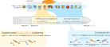

# Contrastive Consolidation of Top-Down Modulations Achieves Sparsely Supervised Continual Learning

*Viet Anh Khoa Tran, Emre O. Neftci, Willem A. M. Wybo*<br>
[Neuromorphic Software Ecosystems (PGI-15), Research Center Jülich](https://www.fz-juelich.de/en/pgi/pgi-15)

[[Overview](https://ktran.de/papers/tmcl/)] [[arXiV](https://arxiv.org/abs/2505.14125)] 

<p align="center">
    
</p>
This is the PyTorch implementation of the task-modulated contrastive learning (TMCL) algorithm.
TMCL provides a novel approach to sparsely supervised continual learning by 
continually integrating supervised top-down modulations with contrastive learning.

## Installation
```bash
pip install -r requirements.txt
pip install -e .
```

## Usage
Our run scripts assume a SLURM envionment. If you want to run the code on a local machine, you can use the `--local` flag in the scripts (not tested).
```bash
python slurm/submit_cifar100_s5.py.
```

